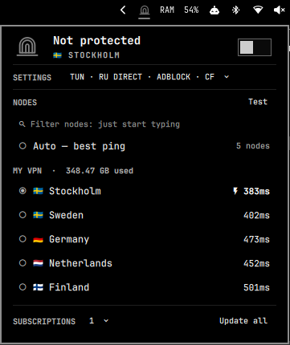

# Xray for Omarchy

An [Omarchy](https://omarchy.org) bar widget that runs your Xray subscription
in the background: connect/disconnect, node switching or **Auto** (best ping),
proxy or **TUN** mode, routing presets, DNS choice, latency tests,
subscription updates and live traffic.



```
Panel.qml ──▶ bin/omarchy-xray (manager, in the plugin folder)
                 ├─ both modes ─▶ systemd --user  omarchy-xray.service  ─▶ /usr/bin/xray (no privileges)
                 └─ TUN mode   ─▶ systemd --user  omarchy-xray-tun2socks.service ─▶ tun2socks (no privileges)
                                   └─ starts ─▶ systemd system  omarchy-xray-tun.service (root: ip + resolvectl only)
Panel.qml ──▶ 127.0.0.1:15491/debug/vars  (live traffic, straight from xray's metrics)
```

No daemon accounts, no passwords, no REST: the widget runs `omarchy-xray`
commands and reads JSON back.

## Features

- **Nodes**: every node from your subscriptions, grouped per subscription, filter as you type. No subscription? Paste share links or an Xray JSON config (whole config, list of configs or one outbound); they collect in a **Manual** group.
- **Protocols**: VLESS, VMess, Trojan, Shadowsocks (incl. 2022), Hysteria2 share links and Xray-JSON subscriptions (Remnawave/Marzban style), every transport the current core supports ([table](#protocols-and-transports)).
- **Auto**: up to 32 nodes (best tested latency first) behind a `leastPing` balancer fed by Xray's observatory (`generate_204` every minute).
- **Modes**: proxy (no privileges) and TUN (whole system, one-time setup).
- **Settings** (a page of its own, opened from the summary row): routing **ALL** / **<CC> DIRECT**, **DNS** (Cloudflare, Google, Quad9, AdGuard, the network's own, or **OWN**: any IP or `https://`/`tls://`/`tcp://`/`quic://`/`h2c://` server through the tunnel; TUN only), **Adblock**, **Fragment** (splits the TLS ClientHello of TLS nodes against DPI; not REALITY or QUIC), **Rules** (a domain, IP/CIDR, `geosite:…` or `geoip:…` sent DIRECT, through the VPN or blocked, checked before the presets), **Auto** (all or starred only), **Chain**, **Mux**, **LAN**, **Log** level, **UA**, **Backup** (settings via the clipboard), **Login** (connect when you log in; off, every login starts with the VPN off and leftover proxy settings cleared).
- **Subscriptions**: traffic used/total and expiry (`subscription-userinfo`), `profile-title`, refresh every `profile-update-interval` (default 24 h); fetched through the tunnel when direct is blocked. **Update all** shows `Fail N` when some fail.
- **Latency**: batched, one xray process per 32 nodes; runs 20 s after the shell starts and every 30 min. **Test** shows `Fail N` for nodes that did not answer.
- **Bar icon**: click opens the panel, right-click connects/disconnects, middle-click refreshes; bright when on, dimmed when off.
- **Panel**: pinned status line (errors offer **Logs** or **Doctor**), live speeds and totals, picking a node while off only selects it (the switch connects).

### Keys

Commands take Ctrl so typing never triggers them; just type to filter (`/` first for a name starting with h, j, k or l). Hover the panel's icon for a reminder, press `?` for the full legend.

| Key | Action |
|---|---|
| `j`/`k`, `h`/`l` | Move through rows / choose in a row (the flag grid in two directions) |
| `Enter` | Apply the chip, select (or switch to) the node |
| `Home` / `End` / `PgUp` `PgDn` | The switch / last node / a page |
| `Ctrl+C` | On/off (off under the kill switch takes a second press) |
| `Ctrl+T` | Test the node under the cursor, or all (again to stop; works in the filter) |
| `Ctrl+R` / `Ctrl+A` | Update subscriptions / add one |
| `Ctrl+O` / `Ctrl+L` | Config folder / logs |

## Protocols and transports

| Link | Xray outbound |
|---|---|
| `vless://` | VLESS, incl. `flow` (Vision) and **VLESS Encryption** (`mlkem768x25519plus…`, ML-KEM keys) |
| `vmess://` | VMess (base64 JSON and `vmess://uuid@host` forms) |
| `trojan://` | Trojan |
| `ss://` | Shadowsocks: SIP002, legacy base64, 2022-blake3-* (Xray has no plugins) |
| `hysteria2://`, `hy2://` | Hysteria2 (`auth`, `sni`, `obfs=salamander`, `pinSHA256`; port hopping `443,20000-30000` or `mport=` via Xray's `udphop`, every 30 s) |

| `type=` | Transport | Notes |
|---|---|---|
| `tcp` / `raw` | RAW | `headerType=http` (host/path) |
| `ws` | WebSocket | `host`, `path` (incl. `?ed=` early data) |
| `grpc` | gRPC | `serviceName`, `authority`, `mode=multi` |
| `xhttp` / `splithttp` | XHTTP | `mode`, `host`, `path`, `extra` (JSON) |
| `httpupgrade` | HTTPUpgrade | `host`, `path` |
| `kcp` / `mkcp` | mKCP | `seed`, `headerType` via `finalmask` (`mkcp-legacy`) |
| (Hysteria2) | hysteria | QUIC, salamander via `finalmask` |
| `h2`, `http`, `h3`, `quic` | — | removed from Xray-core: skipped with a reason (use XHTTP) |

Security: `tls` (`sni`, `fp`, `alpn`, `ech`, `pcs`, `vcn`), `reality` (`pbk`,
`sid`, `spx`, `pqv` / ML-DSA-65), `none`. Unknown fingerprints fall back to
`chrome`. `allowInsecure` is gone from the core: such links use normal
verification (pin with `pcs`). VLESS/Trojan without TLS/REALITY/encryption to a
public server is refused by Xray ≥ 26.7 and skipped with that reason.

Every fetched node is checked against **your installed core** (`xray run -test`);
a rejected node is dropped with a reason ("N nodes skipped" under NODES).
Only the selected node (or the Auto members) goes into `config.json`, and every
generated config is tested before it replaces the running one.

## Requirements

- Omarchy Quattro (shell plugins); `/usr/bin/python3`, `curl` (part of Omarchy).
- Xray core **≥ 26.6.1** (tested with 26.6.1 and 26.9.9). Install it yourself from a source you trust (review the AUR package, then `omarchy pkg aur add xray`): the plugin never installs packages or grants capabilities. Older cores work for most nodes; what they reject is skipped, and `doctor` warns.
- TUN only: [tun2socks](https://github.com/xjasonlyu/tun2socks) ≥ 2.5 (`omarchy pkg aur add tun2socks`), runs as your user.
- Optional geo data for presets and adblock (`geoip.dat`, `geosite.dat`; Arch: `v2ray-geoip`, `v2ray-domain-list-community`), found in `$XRAY_LOCATION_ASSET`, next to the xray binary, `/usr/share/xray` or `/usr/share/v2ray`.

## Install, update, remove

```bash
omarchy pkg aur add xray          # the core (review the AUR package first)
omarchy pkg aur add tun2socks     # optional, TUN mode only
omarchy plugin add https://github.com/KRIEZIEYR/omarchy-xray.git --enable
```

Click the bar icon: the first run asks for your subscription URL, or paste
servers (share links one per line, or Xray JSON) into the same field. It
reaches the manager through the environment, never argv, and is kept only in
`state.json` (`0600`). That is all proxy mode needs; for TUN pick **TUN** and
confirm the password prompt once.

No install script: until you connect nothing exists outside the plugin folder.
The first connect writes `omarchy-xray.service` and
`omarchy-xray-tun2socks.service` to `~/.config/systemd/user`; subscriptions live
in `~/.config/omarchy-xray` (`0700`).

```bash
# update (the manager rewrites its units on the next connect)
omarchy plugin update krieziey.omarchy-xray && omarchy restart shell

# remove: cleanup stops the tunnel, undoes TUN setup (one prompt, only if set
# up), clears the proxy settings and deletes the two user units
~/.config/omarchy/plugins/krieziey.omarchy-xray/bin/omarchy-xray cleanup
omarchy plugin remove krieziey.omarchy-xray
rm -rf ~/.config/omarchy-xray     # optional: subscriptions and settings
```

From 3.0 or older: with TUN set up, pick TUN again and confirm (the old xray
unit with `CAP_NET_ADMIN` is replaced). If you used `install.sh`, switch once
(subscriptions stay):

```bash
omarchy plugin remove krieziey.omarchy-xray && rm -f ~/.local/bin/omarchy-xray
omarchy plugin add https://github.com/KRIEZIEYR/omarchy-xray.git --enable
```

## Command line

The panel covers all of this. For a short name:
`ln -s ~/.config/omarchy/plugins/krieziey.omarchy-xray/bin/omarchy-xray ~/.local/bin/`

```bash
export OMARCHY_XRAY_SUB_URL=<url>; omarchy-xray import -   # add a subscription (or pipe it on stdin)
wl-paste | omarchy-xray import -    # servers: share links / Xray JSON → Manual group
omarchy-xray status                 # JSON state (what the widget reads; URLs redacted)
omarchy-xray select Finland         # by name substring, key (k…), n<index> or "auto"
omarchy-xray on | off | restart
omarchy-xray mode proxy|tun
omarchy-xray routing global|<region>-direct   # e.g. kz-direct
omarchy-xray dns cloudflare|google|quad9|adguard|system
omarchy-xray fav <key>              # star / unstar (starred first; Auto can use only them)
omarchy-xray set autofav|lan on|off # lan: socks 20172 / http 20173 for your network, with a password
omarchy-xray set mux on|off|<n>     # multiplexing, n streams (not Vision/XHTTP/Hysteria2)
omarchy-xray set loglevel error|warning|info|debug
omarchy-xray set ua <text|default>  # subscription User-Agent
omarchy-xray chain <key|off>        # first hop: the exit node is dialed through it
omarchy-xray share <key> [qr|copy]  # share link (or Xray JSON); qr writes a PNG, copy uses the clipboard
omarchy-xray whoami                 # exit IP and country, through the tunnel
omarchy-xray route youtube.com      # where it goes (vpn/direct/block) and which rule decides
omarchy-xray routing ru-blocked     # only sites blocked in Russia go through the VPN
omarchy-xray set failover on        # switch to the fastest node when yours stops answering
omarchy-xray handler on             # clicked vless://, hy2://, omarchy-xray://add/… links import here
omarchy-xray speed                  # download speed through the tunnel
omarchy-xray scan                   # import from a QR code on screen (grim, slurp, zbar)
omarchy-xray geo update             # fresh geoip/geosite.dat (runetfreedom), sha256-checked
omarchy-xray set subupdate 6        # auto-update every 6 h (auto = provider's interval, off)
omarchy-xray settings export|copy|import -|paste   # settings without subscriptions or passwords
omarchy-xray dns custom https://dns.example/dns-query   # or an IP, tls://…, quic://…
omarchy-xray adblock on|off
omarchy-xray fragment on|off [packets length interval]   # e.g. on tlshello 100-200 10-20
omarchy-xray rule add direct|proxy|block example.com   # or 10.0.0.0/8, geosite:…, geoip:…
omarchy-xray rule rm 0
omarchy-xray update [index]         # all subscriptions or one
omarchy-xray test [key…]            # latency (first 200 nodes or the given keys, 10 min cap)
omarchy-xray logs [n] | doctor | cleanup
```

Proxies: socks5 `127.0.0.1:20170`, HTTP `127.0.0.1:20171`; private networks
always bypass. In **proxy mode** the manager also sets the GNOME/GTK system
proxy and the session environment (`http_proxy`, `https_proxy`, `all_proxy`,
`no_proxy` via `systemctl --user set-environment`), so apps launched afterwards
use it; TUN or off clears both.

## Routing presets

- **ALL**: everything except private networks through the VPN.
- **<CC> DIRECT**: one country's ccTLDs and `geoip:<code>` go direct, plus a geosite list where one exists (RU: `.ru/.su/.рф` + `geosite:category-ru`, CN: `geosite:cn`, IR: `geosite:category-ir`). Regions: RU BY KZ UZ TM CN IR TR AE SA EG PK VN MM. Without geo data only the ccTLDs apply.
- **RU BLOCKED**: only `geosite:ru-blocked` and `geoip:ru-blocked` go through the VPN, everything else direct. The lists come from [runetfreedom](https://github.com/runetfreedom/russia-v2ray-rules-dat): run `omarchy-xray geo update` (or Geo → UPDATE) first. Without them the config sends everything through the VPN, never everything direct.
- **Adblock**: `geosite:category-ads-all` → blackhole (needs geo data).

`omarchy-xray route <domain|ip>` (RULES → Check in the widget) says where a destination goes and which rule decides.

## Opening links

`omarchy-xray handler on` (SYSTEM → Links) registers a hidden `.desktop` entry as the opener of
`vless://`, `vmess://`, `trojan://`, `ss://`, `hysteria2://`, `hy2://` and the plugin's own
`omarchy-xray://` scheme. A clicked link is imported (share links into Manual, a URL as a
subscription) and a notification says what happened. `handler off` or `cleanup` removes the entry.

Other clients' schemes (`happ://`, `v2rayn://`) are left to them. To hand out a subscription
or a server for this client, wrap it:

```
omarchy-xray://add/https://sub.example.com/abcdef
omarchy-xray://add/vless://uuid@host:443?security=reality&…#Name
omarchy-xray://add/https%3A%2F%2Fsub.example.com%2Fabcdef     # percent-encoded also works
```

The link is a secret: the browser passes it to the opener as an argument (briefly visible in the
process list); from there it reaches the manager only through the environment.

## TUN mode

All system traffic (TCP, UDP) goes through Xray. **Xray never gets a
capability**: root only creates the device and routes; everything that touches
traffic runs as you.

```
apps ─▶ routes ─▶ xray0 ─▶ tun2socks (you) ─▶ 127.0.0.1:20170 ─▶ xray (you) ─▶ physical link ─▶ server
```

**`omarchy-xray tun-setup`** (once, one polkit prompt; or `sudo omarchy-xray tun-install`) writes, all-or-nothing:

| File (root:root 0644) | Purpose |
|---|---|
| `/etc/systemd/system/omarchy-xray-tun.service` | root **oneshot** running only `ip`, `udevadm`, `resolvectl` with fixed arguments: `xray0` owned by your uid, `198.18.0.1/30` (+ a ULA /126), routes and resolved DNS; stop deletes them. `CapabilityBoundingSet=CAP_NET_ADMIN`, `NoNewPrivileges`, `ProtectSystem=strict`, `ProtectHome`, … |
| `/etc/polkit-1/rules.d/49-omarchy-xray.rules` | **only your user** may `start`/`stop`/`restart` **only that unit** without a password |
| `/etc/systemd/network/10-omarchy-xray.network` | only with systemd-networkd: keeps it away from `xray0` |
| `/var/lib/omarchy-xray/tun-install.json` | the record: your uid and each file's SHA-256 |

Ownership rules:

- The setup reads nothing but your uid (`PKEXEC_UID`/`SUDO_UID`). It replaces or removes only files it wrote for you and that are unchanged (per the record, or byte-identical for older installs); another user's setup or a foreign, changed or symlinked file makes it refuse with nothing changed. `tun-remove` refuses on a foreign unit and keeps (and names) foreign files.
- `xray0` carries the alias `omarchy-xray`: only such a device is deleted, a foreign `xray0` makes the start refuse, a failed start rolls back, and rules are removed by exact spec (pref + selector + table). `sh` only wraps two such `ip` checks.
- Every start/stop of the root unit (setup, `tun-remove`, `off`, `cleanup`, the tun2socks hooks `tun-unit start|stop`) goes through one check: systemd must have loaded it from `/etc/systemd/system/omarchy-xray-tun.service`, with no drop-ins, unchanged on disk, and that file must be the one written for your uid. Otherwise it is never started or stopped.
- No third-party binary runs as root or with capabilities, so nothing to re-attest after updates. No setcap, no sudoers. Undo with `omarchy-xray tun-remove`.

The user unit `omarchy-xray-tun2socks.service` starts the root unit, runs
`omarchy-xray tun-run` (tun2socks on `xray0` → socks port) and stops it again:
the device lives exactly as long as TUN mode.

**Routing.** The default route into `xray0` lives in table `18180`, selected by
three `ip rule`s (prefs 18180–18182; IPv6 two): `main` first without its default
route (LAN stays local), then lookups with no source yet or from `198.18.0.1`
go to the tunnel. Xray binds its connections to the physical interface
(`sockopt.interface`, unprivileged `SO_BINDTODEVICE`, Linux ≥ 5.7) so it never
loops, and passes a strict `rp_filter`. `tun-run` follows default-route changes
(Wi-Fi ↔ Ethernet) and rebinds within ~5 s.

**Kill switch.** If tun2socks or xray crashes, the device and routes stay:
traffic is blocked, never sent direct, while systemd restarts them; the panel
shows **Kill switch on** and a critical notification fires. Only a deliberate
off (two presses in the panel, or `omarchy-xray off`, or switching to proxy) lifts it.

**DNS.** systemd-resolved sends everything to `198.18.0.2` on `xray0`; Xray
answers with a `dns` outbound using the panel's DNS choice (DoH by IP through
the tunnel, or **SYS**: the network's own resolvers, direct). Server hostnames
are resolved by bootstrap servers (the link's DNS + `1.1.1.1`, direct) so the
tunnel never waits on itself.

Check by hand: `omarchy-xray doctor`, `ip addr show xray0` (`198.18.0.1/30`),
`ip rule | grep 1818` (three rules), `ip route show table 18180`,
`resolvectl status xray0` (`198.18.0.2`, `~.`), `curl -s https://ifconfig.me`.

## custom.json

`~/.config/omarchy-xray/custom.json` (Ctrl+O opens the folder) is merged into
every generated config; the result must pass `xray run -test`, otherwise it is
refused and the running config stays. Run `omarchy-xray restart` after editing.

| Key | Merge |
|---|---|
| `routing.rules` | inserted before the preset rules |
| `routing.balancers` | appended; other `routing` keys override |
| `dns.servers` | prepended; other `dns` keys override |
| `outbounds`, `inbounds` | appended (reserved tags: `proxy`, `direct`, `block`, `dns-out`, `tun-in`, `socks-in`, `http-in`, `auto`, `node-*`) |
| `proxyPatch` | deep-merged into the proxy outbound(s) (`sockopt`, …) |
| `bootstrapDns` | IPs that resolve server hostnames in TUN mode |
| anything else | deep-merged at the top level (`log`, `policy`, …); `_`-keys ignored |

Presets, Auto, DNS and interface binding are already generated; the usual
reason to edit is your own rules, e.g. domains always direct:

```json
{ "routing": { "rules": [
  { "domain": ["domain:example.org", "domain:intranet.lan"], "outboundTag": "direct" }
] } }
```

`mux` is useless with XTLS Vision, XHTTP (it has `xmux`) or gRPC (own
multiplexing); a ClientHello `fragment` helps only plain-TLS nodes under DPI, not Reality.

## Security notes (marketplace review)

- Xray and tun2socks never run as root or with a capability. TUN is opt-in; its setup is the only privileged step ([above](#tun-mode)); the polkit rule covers one user, one unit, three verbs.
- The manager refuses root except `tun-install`/`tun-uninstall`, uses `#!/usr/bin/python3 -I`, absolute tool paths and an environment allowlist for children; the widget starts processes with a cleared environment plus an allowlist.
- Downloads: HTTPS only (redirects re-checked), 2 MiB streaming cap, strict per-protocol validation with bounds (2000 nodes, 5000 lines).
- Secrets: `~/.config/omarchy-xray/` `0700`, `state.json`/`config.json` atomic `0600` no-follow writes; `import -` reads from `$OMARCHY_XRAY_SUB_URL`/stdin (120 KiB cap), a URL in argv is refused; status and errors show `host/***` only; test configs in `$XDG_RUNTIME_DIR/omarchy-xray` (`0700`).
- Loopback-only listeners: socks 20170, http 20171, metrics 15491.
- Widget: per-slot hard deadlines with SIGKILL + env wipe, 512 KiB stdout cap, 1000-node render cap, bounded input, credentials scrubbed before display, all provider text rendered as plain text.

## Widget setting and scripting

**Refresh interval** (default `20` s): the closed-panel poll; the open panel
reads status every 4 s and traffic every 2 s.

`omarchy-shell krieziey.omarchy-xray VERB`:

| Verb | Effect |
|---|---|
| `toggle` / `open` / `close` | Panel |
| `status` | One-line summary |
| `connect` / `disconnect` | Selected node on / off (no-op if already there) |
| `toggleProxy` | On/off; off under the kill switch needs a second call within 4 s |
| `select <name>` | Connect to the first node whose name matches |
| `test` / `updateSubs` | Latency test / re-fetch subscriptions |
| `subRemove <index>` | Remove a subscription |
| `mode <proxy\|tun>` | Switch mode (runs the TUN setup first if needed) |
| `routing <global\|<cc>-direct>` / `adblock <on\|off>` | Presets |
| `tunSetup` / `openFolder` | One-time TUN setup / config folder |

```ini
bind = $mainMod SHIFT, V, exec, omarchy-shell krieziey.omarchy-xray toggleProxy
bind = $mainMod SHIFT, C, exec, omarchy-shell krieziey.omarchy-xray toggle
```

## Troubleshooting

- `omarchy-xray doctor`: core version and ownership, geo data, `/dev/net/tun`, kernel, tun2socks, TUN files, polkit agent, resolved/networkd, v2 leftovers, service state (also the panel's **Doctor** button).
- `omarchy-xray logs`: the active unit's journal (the panel's **Logs**).
- "N nodes skipped (…)" under NODES says why links were not imported.

## Development

```bash
node tests/run.js                                   # widget model
python3 -m unittest discover -s tests/manager       # manager (links, config, TUN files)
OMARCHY_XRAY_TEST_BIN=/path/to/xray python3 -m unittest discover -s tests/manager   # + xray run -test
python3 -m py_compile bin/omarchy-xray && omarchy plugin validate .
```

Run from a checkout (remove an installed copy first), restart the shell after QML changes:
`ln -s "$PWD" ~/.config/omarchy/plugins/krieziey.omarchy-xray && omarchy plugin enable krieziey.omarchy-xray right && omarchy restart shell`

State lives in `~/.config/omarchy-xray/`: `state.json` (subscriptions and their
info, nodes with stable ids and prepared outbounds, selection, mode, presets,
DNS), `config.json` (generated core config), `latency.json` (by node id), all `0600`.

## License

MIT.
